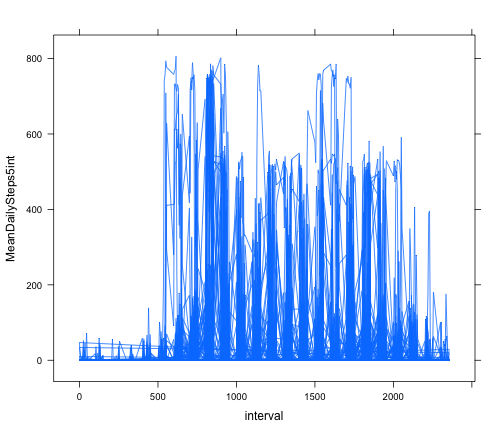
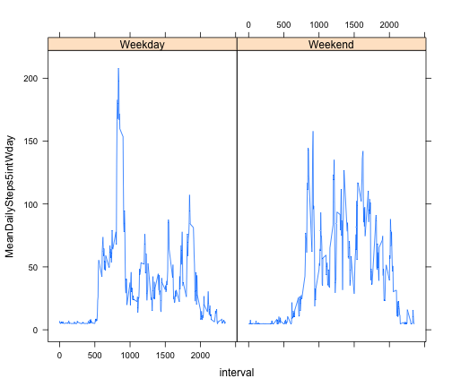

Reproducible Research: Peer Assessment 1
========================================================
This is a markdown document that contains the explanation and R code for my peer assesment 1 assignment for the
Coursera reproducible research course in the Data Science specilization.


## Loading and preprocessing the data


```r
activity <- read.csv("./activity.csv", header = TRUE)
```


## What is mean total number of steps taken per day?


```r
require(data.table)
```

```
## Loading required package: data.table
```

```r
activity_dt <- data.table(activity)

steps_by_day <- activity_dt[, data.frame(DailySteps = sum(steps, na.rm = TRUE)), 
    by = date]
```


Plot histogram of Daily Steps


```r
hist(steps_by_day$DailySteps)
```

 

```r
# plot(steps_by_day$DailySteps, type='h')
```


```r
# calculate Mean
mean(steps_by_day$DailySteps)
```

```
## [1] 9354
```

```r

# calculate Median
median(steps_by_day$DailySteps)
```

```
## [1] 10395
```


## What is the average daily activity pattern?


```r
# calculate Mean of interval
mean_steps_by_day_5int <- activity_dt[, data.frame(MeanDailySteps5int = mean(steps, 
    na.rm = TRUE)), by = "date,interval"]

head(mean_steps_by_day_5int)
```

```
##          date interval MeanDailySteps5int
## 1: 2012-10-01        0                NaN
## 2: 2012-10-01        5                NaN
## 3: 2012-10-01       10                NaN
## 4: 2012-10-01       15                NaN
## 5: 2012-10-01       20                NaN
## 6: 2012-10-01       25                NaN
```

Plot of the Interval


```r
library(lattice)
xyplot(MeanDailySteps5int ~ interval, mean_steps_by_day_5int, type = "l")
```

 


The 5-minute interval with the maximum number of steps in 5-minute interval 60

## Imputing missing values

Missing data will be imputted by finding the average steps and using that avarage to replace the missing Data


```r

noNaVals <- complete.cases(activity)
activity_na <- activity[!noNaVals, ]

# Total number of rows with NA values
nrow(activity_na)
```

```
## [1] 2304
```

```r

# Imputing missing values
activity_noNa <- activity

avgSteps <- mean(activity_noNa$steps, na.rm = TRUE)

random.impute <- function(a, b) {
    naVal <- is.na(a)
    imputed <- a
    imputeWith <- b
    imputed[naVal] <- imputeWith
    return(imputed)
}

activity_noNa2 <- random.impute(activity_noNa, avgSteps)

# imputed data set
head(activity_noNa2)
```

```
##   steps       date interval
## 1 37.38 2012-10-01        0
## 2 37.38 2012-10-01        5
## 3 37.38 2012-10-01       10
## 4 37.38 2012-10-01       15
## 5 37.38 2012-10-01       20
## 6 37.38 2012-10-01       25
```

```r


require(data.table)
activity_noNa2 <- data.table(activity_noNa2)

steps_by_day_noNa <- activity_noNa2[, data.frame(DailySteps = sum(steps, na.rm = TRUE)), 
    by = date]
head(steps_by_day_noNa)
```

```
##          date DailySteps
## 1: 2012-10-01      10766
## 2: 2012-10-02        126
## 3: 2012-10-03      11352
## 4: 2012-10-04      12116
## 5: 2012-10-05      13294
## 6: 2012-10-06      15420
```


Histogram with imputed data


```r
hist(steps_by_day_noNa$DailySteps)
```

 

```r
# plot(steps_by_day_noNa$DailySteps, type='h')
```


Mean and Median with imputed data


```r
# calculate Mean
mean(steps_by_day_noNa$DailySteps)
```

```
## [1] 10766
```

```r

# calculate Median
median(steps_by_day_noNa$DailySteps)
```

```
## [1] 10766
```

There is a difference between the mean and median that was previously calculated when compared to the mean and median that was calculate with the imputed data.

The impact of imputing data on the estimates for total daily numbers is the date 2012-10-01 no longer has Zero daily steps.

## Are there differences in activity patterns between weekdays and weekends?


```r

activity_noNa2[, "dayOfWeek"] <- weekdays(as.Date(activity_noNa2$date))
activity_noNa2$dayOfWeek <- as.factor(activity_noNa2$dayOfWeek)
head(activity_noNa2)
```

```
##    steps       date interval dayOfWeek
## 1: 37.38 2012-10-01        0    Monday
## 2: 37.38 2012-10-01        5    Monday
## 3: 37.38 2012-10-01       10    Monday
## 4: 37.38 2012-10-01       15    Monday
## 5: 37.38 2012-10-01       20    Monday
## 6: 37.38 2012-10-01       25    Monday
```

```r

activity_noNa2[, "typeOfDay"] <- ifelse(activity_noNa2$dayOfWeek %in% c("Saturday", 
    "Sunday"), "Weekend", "Weekday")

mean_steps_by_day_5int_weekdays <- activity_noNa2[, data.frame(MeanDailySteps5intWday = mean(steps, 
    na.rm = TRUE)), by = "interval,typeOfDay"]

head(mean_steps_by_day_5int_weekdays)
```

```
##    interval typeOfDay MeanDailySteps5intWday
## 1:        0   Weekday                  7.007
## 2:        5   Weekday                  5.384
## 3:       10   Weekday                  5.140
## 4:       15   Weekday                  5.162
## 5:       20   Weekday                  5.073
## 6:       25   Weekday                  6.295
```

```r

meanData_5int <- activity_noNa2[, mean(steps), by = "interval,typeOfDay"]

head(meanData_5int)
```

```
##    interval typeOfDay    V1
## 1:        0   Weekday 7.007
## 2:        5   Weekday 5.384
## 3:       10   Weekday 5.140
## 4:       15   Weekday 5.162
## 5:       20   Weekday 5.073
## 6:       25   Weekday 6.295
```

Panel plot time series


```r
library(lattice)
xyplot(MeanDailySteps5intWday ~ interval | typeOfDay, mean_steps_by_day_5int_weekdays, 
    type = "l", layout(1, 2))
```

 

